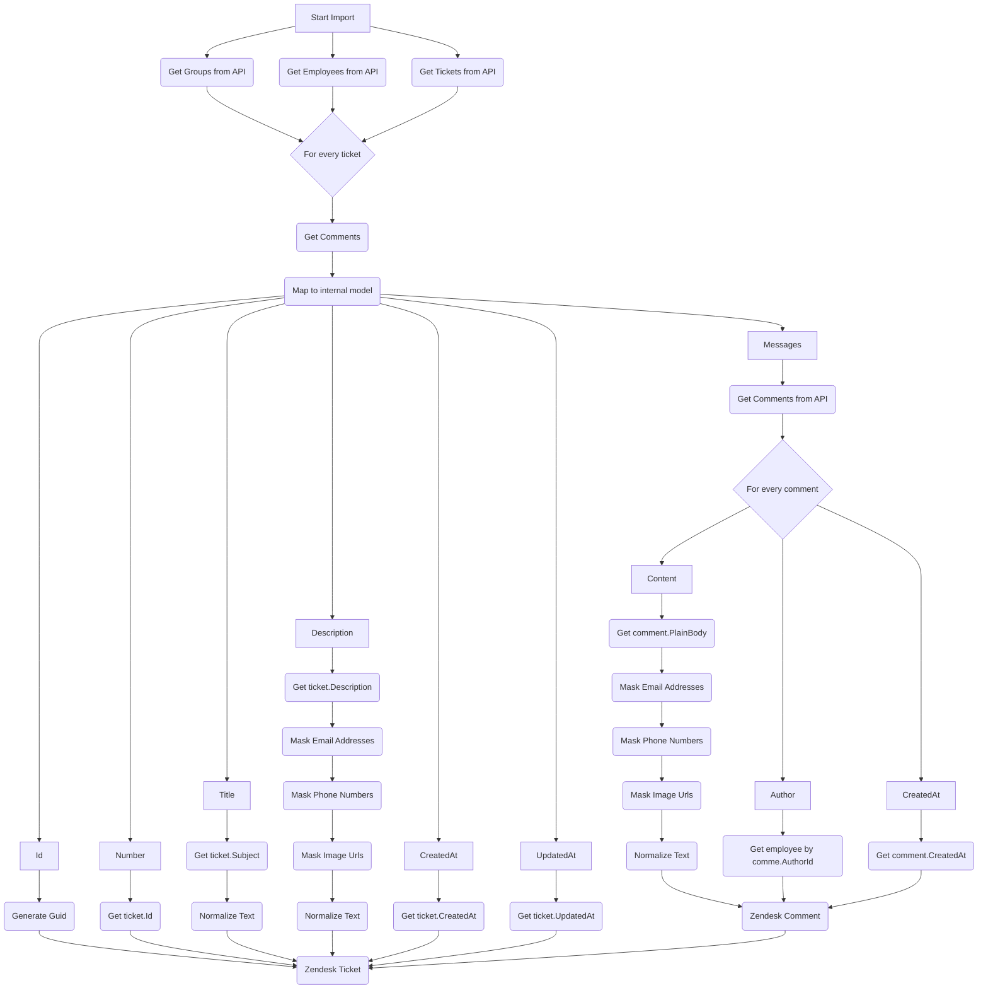

# NexAI

NexAI is an AI agent as a kind of '2.5 line of support.

# Flows
## Parsing Zendesk Tickets

# Versions

### 0.0.9

- Clean up/normalizing data imported from Zendesk.
- Polish search results.

### 0.0.8

- Data importer improvements.

### 0.0.7

- Add support for local LLMs by integrating with Ollama.

### 0.0.6

- Integrate with Zendesk API.

### 0.0.5

- Integrate with Azure DevOps to fetch work items.

### 0.0.4

- Add an option to use Full-Text Search over Zendesk tickets.

### 0.0.3

- Refactoring of the codebase - change the whole structure of project.
- Add MongoDB database integration.
- Store Zendesk tickets into two databases.

### 0.0.2

- Get Zendesk tickets from a sample JSON file.
- Add Qdrant database integration.
- Add docker compose.

### 0.0.1

- Initial version with Semantic Kernel and OpenAI integration.